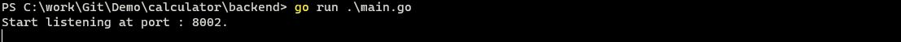
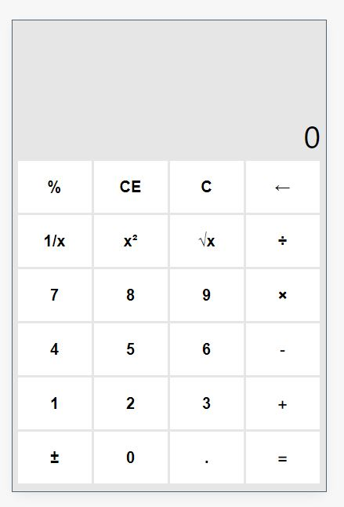
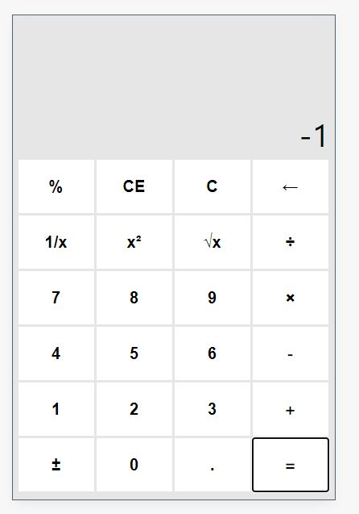
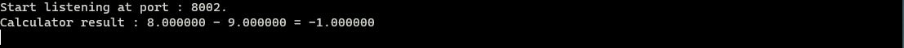

# A Calculator Demo
###### Use react on the fronted and use go on the backennd

## Backend
```bash
cd calculator/backend
go run main.go
```

## Fronted
```bash
#download packages
npm install
#run demo
npm start
```
#### Change port
```json
//package.json
"scripts": {
    "start": "set PORT={your_port}&&react-scripts start",
    "build": "react-scripts build",
    "test": "react-scripts test",
    "eject": "react-scripts eject"
  },
```

## Preview



